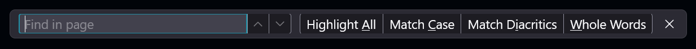

# Firefox Extras: Refined Findbar (centered, fixed, scalable)

This is my personal collection of Firefox customizations, easily installed via a Powershell script.

## Quick Install

```powershell
iwr https://raw.githubusercontent.com/AlexanderReaper7/firefox-extras/main/scripts/deploy.ps1 | iex
```

## Findbar customization

Moves the findbar to the top center of the screen and restyles it.



Based on and inspired by: https://github.com/ravindUwU/firefox-refined-findbar

See [`src/findbar.scss`](src/findbar.scss) for all customization options.

---

## JS Loader

This project vendors the
[MrOtherGuy/fx-autoconfig](https://github.com/MrOtherGuy/fx-autoconfig) JS
loader directly into the repository (under `vendor/fx-autoconfig/`) so that
**zero external dependencies are fetched at deploy time** (supply-chain safety).
The pinned version is fully auditable and can be updated or replaced — see
[`vendor/fx-autoconfig/VENDOR.md`](vendor/fx-autoconfig/VENDOR.md) for details.

### Toolbar Clock

A `clock.uc.js` user script (`chrome/JS/clock.uc.js`) is included that displays
the current date and time in the Firefox toolbar to the right of the address
bar. It is deployed automatically by the deploy scripts alongside the loader.

### ⚠️ Loader install requires elevation on some platforms

The loader requires two files to be placed in the **Firefox installation
directory** (e.g. `C:\Program Files\Mozilla Firefox\` on Windows,
`/usr/lib/firefox/` on Linux):

- `config.js`
- `defaults/pref/config-prefs.js`

The deploy scripts attempt this automatically, but may require you to run as
**Administrator** (Windows) or with **sudo** (Linux/macOS). If automatic
installation fails, copy the files manually from `vendor/fx-autoconfig/program/`
to your Firefox installation directory.

---

Option A: PowerShell Automated Deployment (Recommended)

Run from PowerShell (downloads latest release and installs automatically):

```powershell
iwr https://raw.githubusercontent.com/AlexanderReaper7/firefox-extras/main/scripts/deploy.ps1 | iex
```

Or clone the repo and run locally:

```powershell
pwsh scripts/deploy.ps1           # latest release
pwsh scripts/deploy.ps1 -Local   # from local build
```

**Always review remote scripts before running.**  
**Supported platforms:** Windows, macOS, Linux (requires PowerShell Core on non-Windows)

Option B: Manual Installation

1. Go to [Releases](../../releases) and download `firefox-chrome.zip`.
2. Open your Firefox profile (`about:profiles` → your profile → Open Folder).
3. Extract `chrome/` from the zip into your profile directory (merge if asked).
4. Ensure `about:config` →
   `toolkit.legacyUserProfileCustomizations.stylesheets = true`.
5. Restart Firefox.

---

## Customize (easy)

- Helper page (GitHub Pages): https://AlexanderReaper7.github.io/firefox-extras/
  - Click “Copy SCSS”
  - Open the Sass Playground: https://sass-lang.com/playground/
  - Paste into the SCSS pane, tweak options, copy generated CSS into
    `chrome/findbar.css`.

---

## Repo layout

- `chrome/userChrome.css` — imports the compiled `findbar.css` at runtime; also
  contains toolbar clock styles.
- `chrome/JS/clock.uc.js` — toolbar clock user script (requires the JS loader).
- `src/refined-findbar.scss` — the mixin and styles
- `src/findbar.scss` — entry file configuring options
- `vendor/fx-autoconfig/` — vendored MrOtherGuy/fx-autoconfig JS loader (pinned
  commit; see VENDOR.md)
- `docs/` — helper page for Sass Playground (published via GitHub Pages)
- GitHub Actions:
  - `release.yml`: builds compiled CSS on tag push, uploads release assets
  - `pages.yml`: publishes `docs/` to GitHub Pages

Note: `chrome/findbar.css` is generated and excluded from source. It is included
only in Releases.

---

## FAQ

- Can I reload userChrome.css without restarting Firefox?
  - No; restart is required. Use the Browser Toolbox for temporary iteration,
    then restart.

---

## License

MIT (see LICENSE). Please retain attribution to the original project linked
above.
